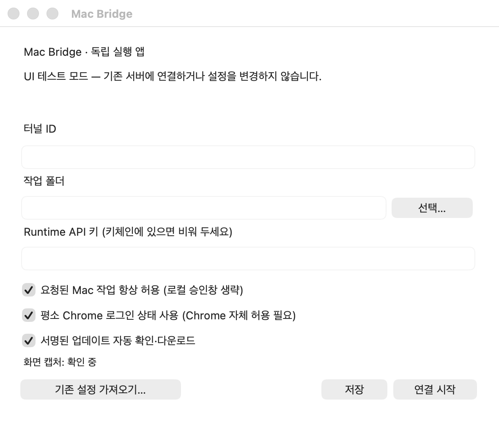

# Computer Controller

ChatGPT에서 내 **Mac·Windows PC 또는 Linux/EC2 서버**의 파일·터미널·브라우저·영상 프레임을 다루는 MCP 연결 도구입니다. **현재 권장 실행 방식은 npx 한 줄**입니다.

## 설치 — npx 한 줄 권장

1. **Node.js 20+**를 설치하세요.
2. [OpenAI Tunnels](https://platform.openai.com/settings/organization/tunnels)에서 `tunnel_...` ID를 만드세요.
3. [Organization API keys](https://platform.openai.com/settings/organization/api-keys)에서 Secret key를 만들고, Restricted key라면 **Tunnels: Read + Use**를 허용하세요.
4. 터미널에서 `npx -y github:oh-jinsu/computer-controller`를 실행하세요. **첫 실행은 자동으로 setup 후 start**, 다음부터는 바로 start 합니다.
5. ChatGPT에서 **설정 → 보안 및 로그인 → 개발자 모드**를 켜세요.
6. [Plugins](https://chatgpt.com/plugins)에서 **Add → Create MCP App → Connection: Tunnel**을 선택하고 같은 터널을 연결하세요. **앱 이름은 원하는 이름**으로 정하면 됩니다.
7. 새 대화에서 만든 MCP App을 선택하고 `status로 연결 상태를 확인해 주세요.`라고 요청하세요.

첫 설정에서는 터널 ID, 작업 폴더, 승인 모드, 브라우저 모드와 Runtime API key를 묻습니다. Linux/EC2는 **always 승인 + dedicated headless browser**를 사용하며, 시스템 Python 3.11+가 없으면 검증된 `uv`로 전용 Python 3.12를 준비합니다.

## 선택 설정

- 상태: `npx -y github:oh-jinsu/computer-controller status`
- 다시 설정: `npx -y github:oh-jinsu/computer-controller setup`
- 진단: `npx -y github:oh-jinsu/computer-controller doctor`
- 자주 쓰거나 자동 시작을 원하면 전역 설치: `npm install -g github:oh-jinsu/computer-controller`
- 전역 설치 후 자동 시작: `computer-controller service install`
- macOS/Windows GUI 새 설치는 **승인창 없이 사용 + 평소 Chrome 로그인 상태 사용이 기본값**입니다.

## GUI 앱 — 선택 사항

GUI를 원하면 [Releases](https://github.com/oh-jinsu/computer-controller/releases)에서 `Computer-Controller-...-macos26-arm64.zip` 또는 `Computer-Controller-...-windows-x64.zip`을 받으세요. GUI와 CLI는 설정을 재사용할 수 있지만 같은 터널을 동시에 두 번 실행할 수는 없습니다.

## 현재 범위

파일 읽기·쓰기·편집·이동·복구 가능한 삭제, 터미널/프로세스, 브라우저, 창 캡처, 작업 컨텍스트를 제공합니다. 영상 확인은 공통 프로세스/파일 도구를 이용한 프레임 추출 워크플로입니다.

현재 배포는 **공개 베타**입니다. 브라우저 파일 업로드와 **별도 백그라운드** 작업 창은 아직 제공하지 않으며, macOS 베타는 **안정판 자동 업데이트 대상이 아닙니다**. Windows GUI는 Authenticode 서명이 없을 수 있고 macOS 공증은 릴리스별 설명을 확인하세요.

[설치·권한·문제 해결](docs/INSTALL.md) · [영상 사용법](docs/VIDEO-WORKFLOW.md) · [개발자 문서](docs/DEVELOPMENT.md) · [배포 상태](docs/RELEASE-STATUS.md) · [외부 구성요소·소스](THIRD-PARTY.md)
